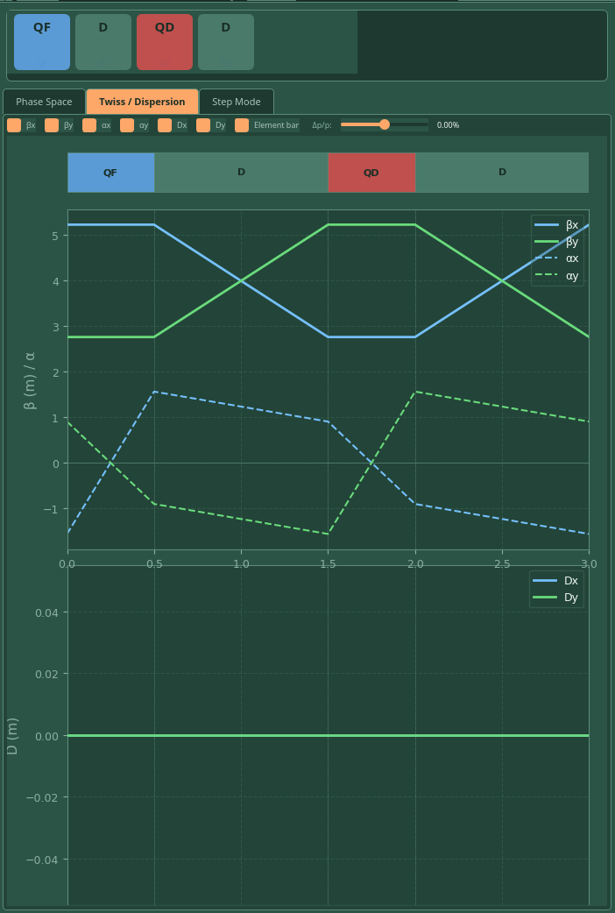
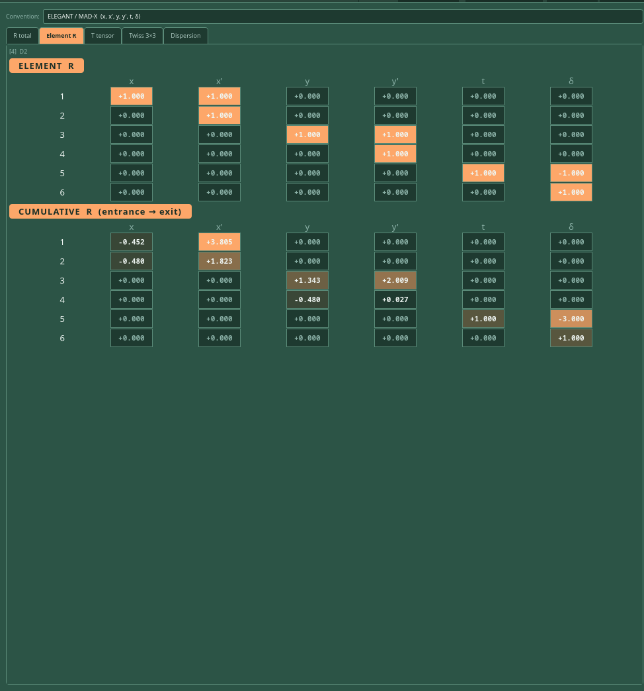
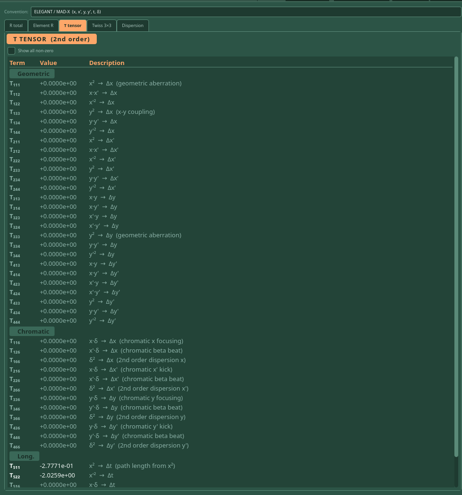
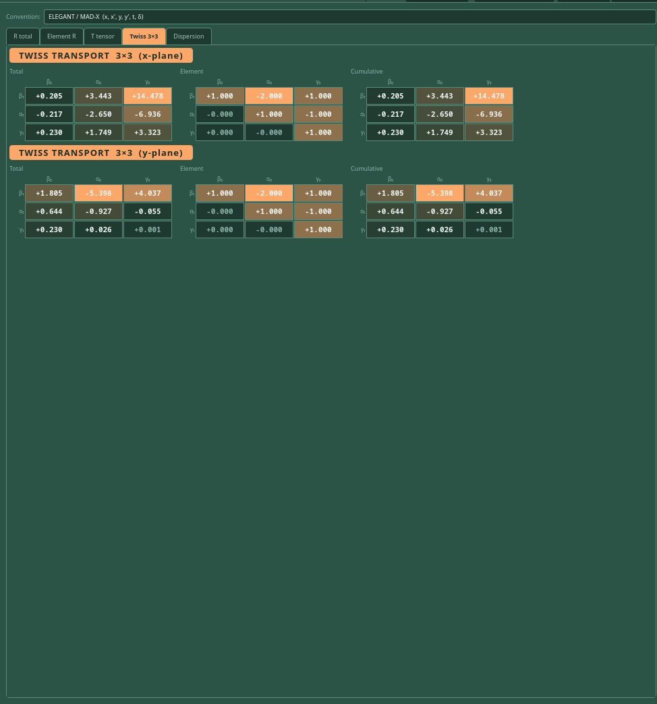
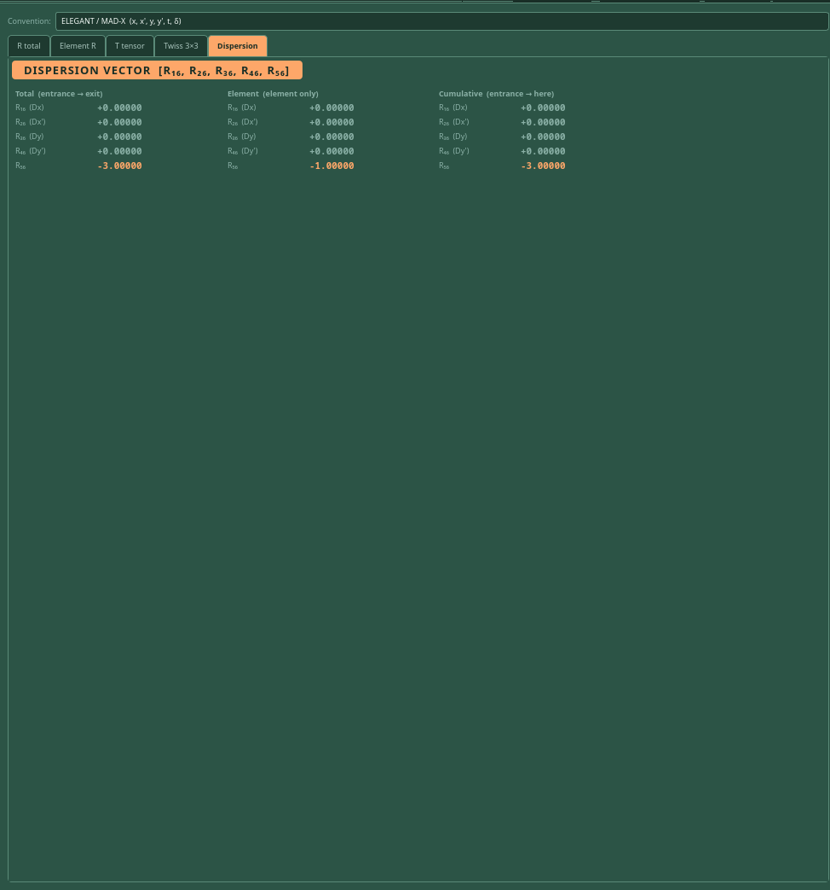
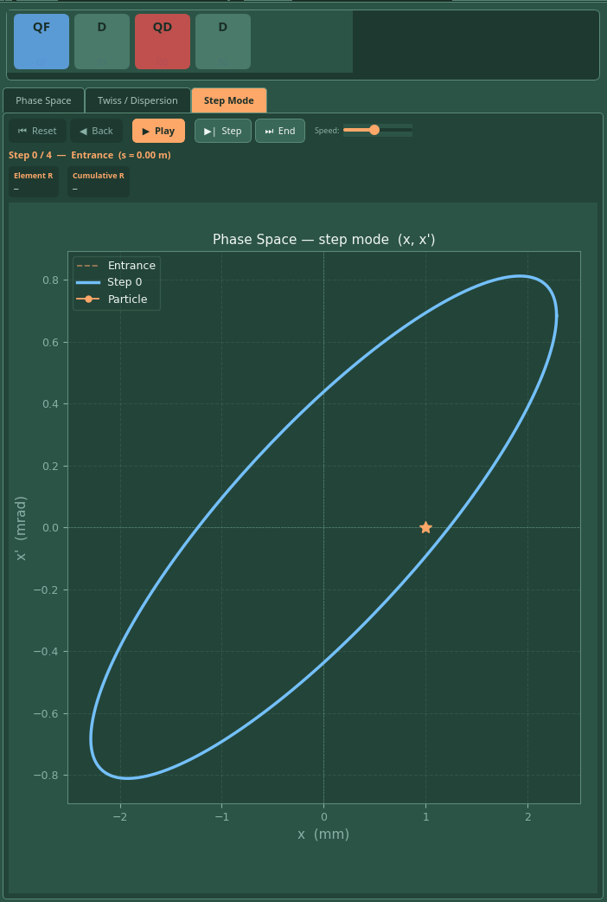

# Examples

All examples use the 4-element FODO cell `QF → D → QD → D` with L = 3.000 m total, operated in Ring mode.

---

## Full GUI — FODO ring

A FODO cell in Ring mode with Qx = Qy = 0.1298. The lattice is stable: |Tr(Rx)| = |Tr(Ry)| = 1.370 < 2. The Phase Space tab shows the periodic entrance and exit ellipses overlapping. The R total panel displays the full one-turn 6×6 matrix with R₅₆ = −3.000 m (path length term for a 3 m lattice).

---

## Twiss and Dispersion

βx(s) and βy(s) are mirror images in a symmetric FODO cell — βx peaks at the QF entrance and reaches its minimum at the QD centre, while βy does the opposite. αx and αy cross zero at the quadrupole centres. Dx and Dy are both zero because the lattice contains no dipoles — there is no source of transverse dispersion.

---

## Element R and Cumulative R

The second drift element (index [4] D2) is selected. The **Element R** matrix is the identity in all transverse planes, with R₅₅ = 1, R₅₆ = −L (path length), and R₆₆ = 1 — the expected 6×6 drift matrix. The **Cumulative R** shows the transport matrix from the lattice entrance through D2, reflecting the net focusing of the two preceding quadrupoles.

---

## T Tensor

All geometric and chromatic T terms are zero for a pure FODO lattice with no sextupoles or dipoles. The longitudinal terms T₅₁₁ = −0.2777 m and T₅₂₂ = −2.026 × 10⁻² are non-zero — these arise from the path-length dependence of a particle's trajectory in the quadrupole fringe fields and are present even without nonlinear magnets.

---

## Twiss 3×3 Transport

The 3×3 Courant-Snyder transport matrices for the x-plane (top) and y-plane (bottom). The Total and Cumulative columns are identical here because no element is selected — both represent the full one-turn transport. The Element column shows the transport for the last-selected element. Off-diagonal terms reflect the alpha–beta coupling introduced by the quadrupoles.

---

## Dispersion Vector

The dispersion column vector R₁₆ through R₅₆ for the full lattice. R₁₆ = R₂₆ = R₃₆ = R₄₆ = 0 — no transverse dispersion, as expected for a lattice without dipoles. R₅₆ = −3.000 m for the total lattice and −1.000 m for the element column, consistent with each drift contributing −L to the path length term.

---

## Step Mode — at Entrance

Step mode at Step 0 (entrance). The blue ellipse (Step 0) and orange dashed ellipse (Entrance) are identical at the start. The particle marker (orange star) sits at x₀ = 1.00 mm, x'₀ = 0.00 mrad. Press **Play** to watch the ellipse shear through the first quadrupole, rotate through the drift, compress through the defocusing quad, and return close to the starting shape after one full turn.
