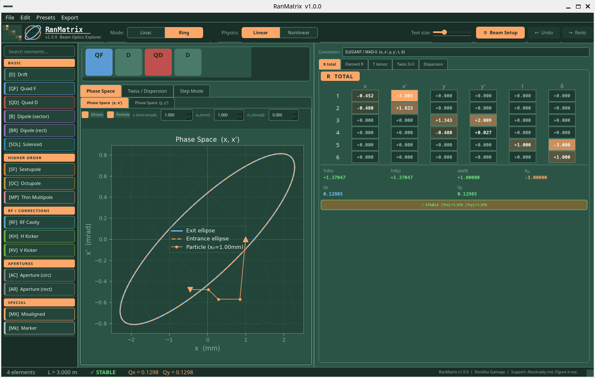

# UI Overview



The RanMatrix window is divided into four regions:

---

## Toolbar (top)

Controls that apply to the whole session:

| Control | Function |
|---|---|
| **Mode: Linac / Ring** | Switch between single-pass and periodic boundary conditions |
| **Physics: Linear / Nonlinear** | Toggle T-tensor second-order tracking |
| **Text size** | Slider to scale the matrix panel font |
| **⚙ Beam Setup** | Open the initial conditions dialog (β₀, α₀, D₀, emittance, particle offset) |
| **← Undo / → Redo** | Step through the history of lattice changes |

---

## Left panel — Element palette

A scrollable list of all 16 supported element types, grouped by category:

- **Basic** — Drift, Quad F, Quad D, Dipole (sector), Dipole (rect), Solenoid
- **Higher order** — Sextupole, Octupole, Thin Multipole
- **RF / Corrections** — RF Cavity, H Kicker, V Kicker
- **Apertures** — Aperture (circ), Aperture (rect)
- **Special** — Misaligned, Marker

Click an element to append it to the lattice. Use the search box at the top to filter by name.

---

## Centre panel — Lattice canvas and plots

The **lattice line** across the top shows all elements as colour-coded blocks. The active element (last selected) is highlighted.

- **Single-click** an element block to select it and view its individual R matrix in the Element R tab.
- **Double-click** to open the parameter editor for that element.
- **Drag** left or right to reorder elements.
- Click the **×** on a block to remove it.

Three tabs sit below the lattice line:

| Tab | Contents |
|---|---|
| **Phase Space** | Entrance/exit ellipses, ghost ellipses, particle trajectory |
| **Twiss / Dispersion** | βx(s), βy(s), αx, αy, Dx, Dy plot with element bar |
| **Step Mode** | Animated element-by-element phase space evolution |

---

## Right panel — Matrix panel

Displays the computed optics for the current lattice. Five tabs:

| Tab | Contents |
|---|---|
| **R total** | Full 6×6 one-turn (Ring) or end-to-end (Linac) transfer matrix |
| **Element R** | 6×6 matrix for the selected element + cumulative from entrance |
| **T tensor** | Second-order T_{ijk} terms grouped by type |
| **Twiss 3×3** | Courant-Snyder 3×3 transport matrix for x and y planes |
| **Dispersion** | R₁₆ through R₅₆ column vector |

The **Convention** selector at the top of the right panel switches between `ELEGANT / MAD-X  (x, x', y, y', t, δ)` and `Bmad` coordinate ordering.

---

## Status bar (bottom)

Shows a real-time summary:

```
4 elements   L = 3.000 m   ✓ STABLE   Qx = 0.1298   Qy = 0.1298
```

In Linac mode, Qx/Qy are replaced by Tr(Rx)/Tr(Ry).
